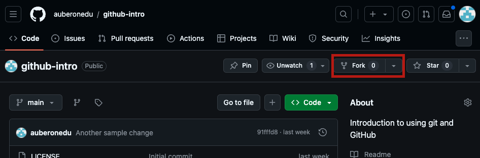
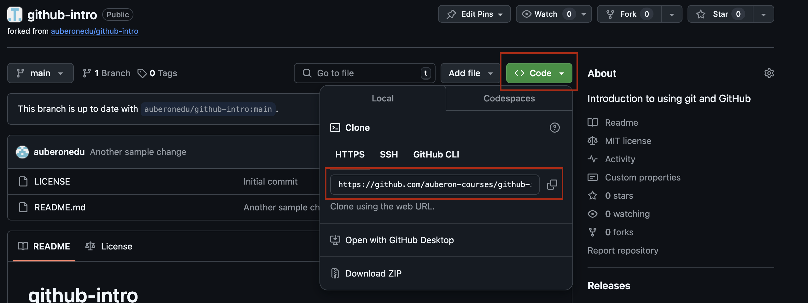

# github-intro
Introduction to using git and GitHub. Will lead you through your first fork, clone, commit, and push. It is common to run into issues when going through this. Don't be shy in asking for help or coming to office hours!


## Fork the Repository (repo)
1. Make sure you are logged into your GitHub account.
1. Fork this repository (repo) by clicking the *fork* button.
 
    > A fork is a *GitHub* concept, not a git concept. It's creating a copy of the repo in your online GitHub account, but it doesn't download the code to your computer. If you have used Replit before, this is similar to creating a fork there.
1. Keep this browser window open,  we will return to it in a moment.


## Navigate your command line
1. Open your command line (Git Bash on Windows, Terminal on Mac).
1. Create a new directory where you will store repositories for this course. By default this will be in your home directory, but you can choose to put it elsewhere if you like. Run the below command to make a directory named `sdev301`.
    ```
    mkdir sdev301
    ```
1. Move into this new directory using the `cd` command:
    ```
    cd sdev 301
    ```
1. Keep your terminal window open, we will return to it in a moment.


## Clone the Repository
1. Go back to the browser window. Ensure that you are looking at your fork of the repository. You should see `YOUR-USERNAME / github-intro` near the top of the screen, where `YOUR-USERNAME` is your GitHub username. This is really important!
1. Click on the green *Code* button. Then, click on the squares to the right of the URL that pops up to copy it to your clipboard.
    
1. Return to your terminal window. Run the below command, replacing `YOUR-CLONE-URL` with the URL you copied from the green *Code* button on GitHub.
    ```
    git clone YOUR-CLONE-URL
    ```
    > Hint: In Windows Git Bash, paste by right-clicking. In Mac Terminal, paste by pressing cmd-V.
1. Verify that the repository was correctly copied by running `ls`. You should see `github-intro` as a directory. 
    >*Cloning* makes a copy from GitHub onto your computer.
1. Change to the repo directory by running:
    ```
    cd github-intro
    ```


# Make a change
1. Open VS Code in the current directory by running:
    ```
    code .
    ```
    If this does not work, you can instead open VS Code, and click on File > Open Folder. Then find and select the `github-intro` folder. Either way, keep the terminal window open. We will return it it soon.
1. Open the `README.md` file. Make any change to it (adding your name, writing a poem, fixing a typo you found, etc).
   > Note that the change you make will be public for anyone on the internet to see.
1. Save the changes.


# Add and commit changes
1. Return to the terminal. It should still be in the `github-intro` directory.
1. Run the below command to check the status of your changes.
    ```
    git status
    ````
    You should expect to see `README.md` in red text.
1. Run the below command to stage your change for a commit:
    ```
    git add README.md
    ```
    > This tells git that you want your changes to the `README.md` file to be included in your next commit.
1. Check the status again:
    ```
    git status
    ```
    `README.md` should now be in green text.
1. Commit the change with some meaningful description:
    ```
    git commit -m "SOME MEANINGFUL DESCRIPTION"
    ```
    > Make sure your description is in quotation marks. It should be a short phrase like "Added haiku to README." For now, do not use special characters like an exclamation mark. This can confuse your terminal.

    > Making a commit is like making a checkpoint. You'll always be able to come back to the way your code is now. However, your commit is only on your computer right now. It is not yet backed up to GitHub.


# Push changes
1. Check the status:
    ```
    git status
    ```
    You should see a message that includes the line `Your branch is ahead of 'origin/main' by 1 commit`.
    > This is telling us that we have one commit that isn't yet backed up to GitHub
1. Push the change to GitHub
    ```
    git push
    ```
1. You will be prompted for a username and password. Use your GitHub username, NOT your Green River username. If a fancy window shows up, use your password for the GitHub website. If it asks you for your password directly on the command line, use your [Personal Access Token](https://docs.github.com/en/authentication/keeping-your-account-and-data-secure/managing-your-personal-access-tokens#creating-a-personal-access-token-classic). Paste it in (right-click for Windows, cmd-V for Mac). When typing in your password/PAT it may not look like any text is showing up. That's OK, it's on purpose to make sure your password stays hidden.
1. If it completes without errors, return to your browser page with YOUR fork (your username should be at the top of the screen and in the URL) of the repo open. Refresh the page and you should see your new change to the README!
   > Note that the changes you have made so far apply ONLY to your fork, not to the original repoitory that I created. Your version is changed, but GitHub won't let you change mine without my permission. In the next section you will use a pull request (PR) to ask for permission to put your changes into my original code. You will be *requesting* that I *pull* your changes into my version.


# Create a Pull Request (PR)
1. After refreshing the page for YOUR fork you should see a message stating that your branch is 1 commit ahead of `auberonedu/github-intro:main`. To the right of this there is a *Contribute# button. Click the *Contribute* button, and then click on the green *Open pull request* button.
  
1. This will take you to a new page. At the bottom of the page you should see a visual representation of the differences (diff) your new change will introduce. Add a title and description to your pull request (PR).
1. Click *Open pull request* to open the pull request.
1. Congrats! You have created your first pull request!
1. In Canvas, please copy the link to the pull request you created to submit your assignment. For this practice exercise I will not be merging your request. But in a real open-source repository, a *maintainer* would give you feedback on your changes, and if they were happy with them the would *merge* your PR (accept your changes into the original version).